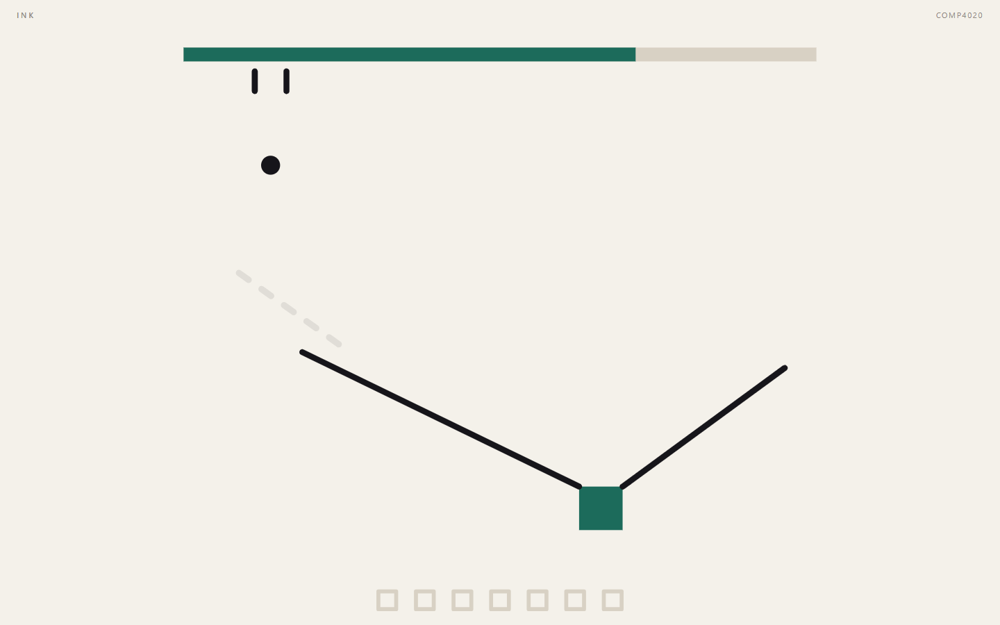
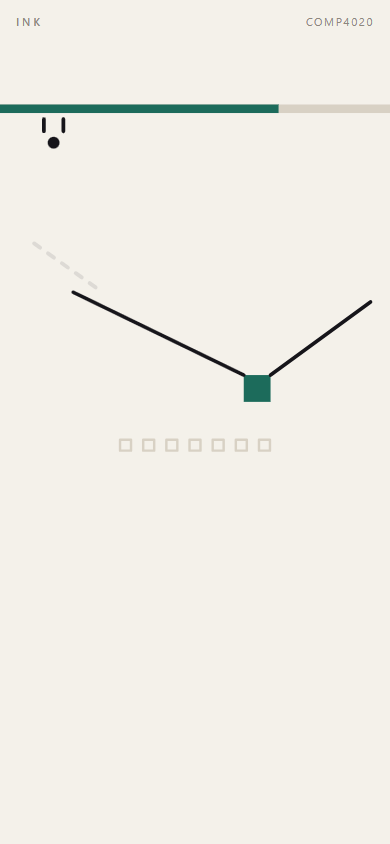

# Process overview

## What I built

**Ink**: a browser game with no words in it. A ball drips from a spout and
falls, a cup sits somewhere it will not reach, and you draw lines for it to
land on. Every line costs ink by its own length, the meter across the top does
not reset between boards, and running dry with the ball out of play ends the
run. Seven boards. The first one opens with a slope already drawn into the cup,
which is the whole tutorial: it is a line exactly like the ones you can make,
and it is visibly the reason a ball that reaches it goes in.

## The moments that mattered

**The rule the brief turns on became a test, not a note.**
[`5357c94`](https://github.com/comp4020-agentic-coding-studio/comp4020-crit5-PressJump/commit/5357c94) is the first commit of my own and it is only
`CLAUDE.md`, carried from C4 with last week's audio rules dropped and this
week's added. The one that mattered is "no instructions, anywhere", because
that is the line an agent breaks while being helpful, one considerate sentence
at a time. So [`79119e1`](https://github.com/comp4020-agentic-coding-studio/comp4020-crit5-PressJump/commit/79119e1) makes it mechanical: the built pages
and the README are scanned for instruction shaped copy, and the page is held to
a prose budget of fifteen words. It currently ships three. A budget catches the
drift a word list never would.

That commit also plays the spec rather than grepping for it. "It can be lost"
is proved by draining the ink and losing; "play ends somewhere" by clearing
seven boards and winning. Both run against the real rules module in a
millisecond, because the rules have no canvas and no clock in them.

**Green proved nothing, twice, and only the second time was my fault.**
My standing rule is that a new test has to catch a deliberate bug first, so I
broke eight things and watched. Seven failed exactly the test meant to forbid
them. Removing the ball's speed cap failed nothing at all: the free fall test I
had written to catch tunnelling passed anyway, because an uncapped ball moves
further per step than the window its own radius gives it to be noticed in, and
whether it slips through comes down to where the samples land. I raised the
drop height twice and it stayed green by luck both times. A test whose verdict
is a coin toss is not a test, so the cap is asserted directly now and the old
test carries a comment saying what it does not prove
([`26a7a29`](https://github.com/comp4020-agentic-coding-studio/comp4020-crit5-PressJump/commit/26a7a29)).

**I built a solver so the boards would stop being guesses.**
`scripts/solve-boards.ts` searches thousands of strokes per board and reports
how many land the ball. That number is the difficulty curve, which I had
otherwise been eyeballing, and it found board one at 1.3 percent when it needed
to be the most forgiving board in the game. Its solutions are pinned into
`src/boards.test.ts`, so `pnpm check` now proves the game is finishable end to
end. Nudging a pillar four units to make a board look better is a one line
change that can make it unwinnable, and nothing else in the repo would say a
word: the build is green, the page renders, the ball falls.

**The obvious way to collide a ball with lines is wrong, and only a browser
said so.** There is no browser automation on this machine, so `scripts/drive.ts`
drives Edge over its own debugging protocol: real viewport, real pointer
events, real pixels. Driving it through all seven boards, one failed that the
suite swore was solvable. A line a player draws is not one segment, it is a
chain of thirty short ones, and every one of them near the ball was claiming
its own bounce in the same tick, so a hand drawn line threw the ball several
times harder than the identical line drawn in one piece. Every test in the repo
used single segments and every one was green. The fix resolves only the deepest
contact per pass; the tests draw sampled strokes now, the way a finger does
([`a9f140b`](https://github.com/comp4020-agentic-coding-studio/comp4020-crit5-PressJump/commit/a9f140b)).

**Playing it showed the difficulty was in the wrong place.**
[`4a1d831`](https://github.com/comp4020-agentic-coding-studio/comp4020-crit5-PressJump/commit/4a1d831) is the change that came from playing rather than
reading. I drew the obvious first stroke on each board, the one anybody tries
on sight, and it cleared board one and nothing else, with each failure costing
half the meter. The difficulty was living in landing precision, which is only
frustrating, instead of in the route, which is the interesting part. So every
cup except board four's now sits in a shallow bowl, and board four's cup is a
hole in its shelf rather than a box standing on it, which is why a rolling ball
used to hit the side of it and stop dead. The curve now runs 6.2, 7.0, 2.4,
1.8, 1.5, 2.9 and 0.6 percent across the seven.

Playing the rebalanced game turned up one more. Screenshotting board three, the
ink meter was within a few percent of full, and so was board seven's. I had
widened the budget to make the early boards kinder and pushed the top-up above
what a stroke actually costs, so the arithmetic refilled the meter faster than
anyone could spend it and the only stakes in the game were decorative. The
top-up is deliberately below a comfortable stroke now
([`52b82cd`](https://github.com/comp4020-agentic-coding-studio/comp4020-crit5-PressJump/commit/52b82cd)), so a run that draws big
confident lines visibly drains and a run that aims drifts up. Neither of those
needed explaining, which is the only kind of rule this brief allows.

The same session broke the solver's advice twice. Pinning the cheapest solution
gave board seven a six degree ramp the ball creeps down for eleven seconds.
Pinning the fastest gave board five a stroke that sank the ball in the suite
and left it resting against the outside of the cup in a real browser. It pins
the most robust one now, meaning the win with the most neighbouring strokes
that also win, which is the closest a search gets to "something a person could
arrive at by aiming".

## What the checks cannot tell you

Whether a stranger knows what to do in ten seconds. That is the one line of
this brief that cannot be tested and cannot be faked, and I am the worst
possible judge of it because I know where every cup is. Four people and a
keyboard settle it, and I stay quiet until someone finishes or gives up.

One thing I could not discharge either. My own rule says a small screen is
proven on a real phone, not an emulated one. This was played at 390 by 844 in a
real Chromium with real pointer events and there is no horizontal overflow, but
nobody has touched it with a thumb.

